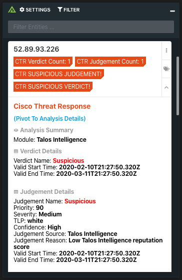

# Polarity Cisco Threat Response Integration

The Polarity Cisco Threat Response integration allows Polarity to search the Threat Response Enrich API to return information about various indicator types.

You can check out the integration in action below:

## Threat Response Integration Options

### Base Threat Response API URL

URL of the Cisco Threat Response API

### Threat Response Client ID

Client ID used to authenticate with the Cisco Threat Response API

### Threat Response Client Password

Client Password used to authenticate with the Cisco Threat Response API

## Installation Instructions

Installation instructions for integrations are provided on the [PolarityIO GitHub Page](https://polarityio.github.io/).

## Polarity

Polarity is a memory-augmentation platform that improves and accelerates analyst decision making.  For more information about the Polarity platform please see:

https://polarity.io/
